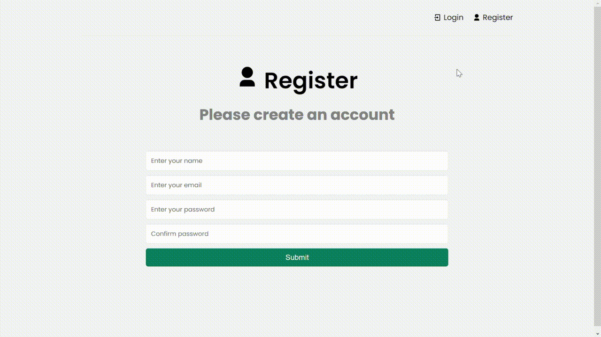

# 😎 Members Only

Members Only it's a project that I've made it to improve my knowledge in the MERN STACK (MongoDB, Express, React and Node).
The users can only post something or see who posted something if they're members.


## How it works




## Features

- Register/Login with authentication
- Create new post
- Update/Delete post
- Update/Delete account


## ⚙️ Environment Variables

To run this project, you will need to add the following environment variables to your .env file

`MONGODB_USERNAME`

`MONGODB_PASSWORD`

`JWT_SECRET`

`NODE_ENV`
    
## Run Locally

Clone the project

```bash
  git clone henriquemoreiraa/members-only
```

Go to the project directory

```bash
  cd members-only
```

Install dependencies

```bash
  npm install
```

Start the server

```bash
  npm run dev
```


## 🛠️ Tech Stack

**Front-end:** React

**Back-end:** Node, Express and MongoDB

